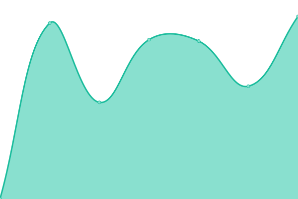
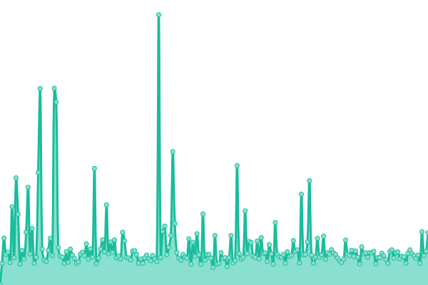
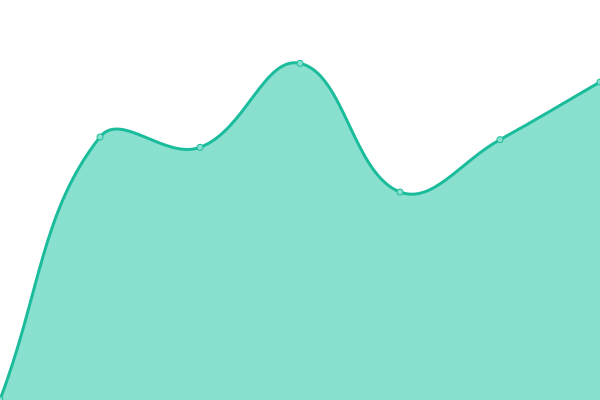

# [📈 Live Status](https://demo.upptime.js.org): <!--live status--> **🟩 All systems operational**

This repository contains the open-source uptime monitor and status page for [Upptime](https://upptime.js.org), powered by [Upptime](https://github.com/upptime/upptime).

With [Upptime](https://upptime.js.org), you can get your own unlimited and free uptime monitor and status page, powered entirely by a GitHub repository. We use [Issues](https://github.com/upptime/upptime/issues) as incident reports, [Actions](https://github.com/upptime/upptime/actions) as uptime monitors, and [Pages](https://demo.upptime.js.org) for the status page.

<!--start: status pages-->
<!-- This summary is generated by Upptime (https://github.com/upptime/upptime) -->
<!-- Do not edit this manually, your changes will be overwritten -->
<!-- prettier-ignore -->
| URL | Status | History | Response Time | Uptime |
| --- | ------ | ------- | ------------- | ------ |
|  [c6h6](https://www.c6h6.org/) | 🟩 Up | [c6h6.yml](https://github.com/kjappelbaum/cheminfo-status/commits/HEAD/history/c6h6.yml) | 

 1263ms
     
 | 

<a href="https://kjappelbaum.github.io/cheminfo-status/history/c6h6">100.00%</a>
    

|  [eln.epfl.ch](https://eln.epfl.ch) | 🟩 Up | [eln-epfl-ch.yml](https://github.com/kjappelbaum/cheminfo-status/commits/HEAD/history/eln-epfl-ch.yml) | 

 1421ms
     
 | 

<a href="https://kjappelbaum.github.io/cheminfo-status/history/eln-epfl-ch">100.00%</a>
    

|  [eln-beta.epfl.ch](https://eln-beta.epfl.ch) | 🟩 Up | [eln-beta-epfl-ch.yml](https://github.com/kjappelbaum/cheminfo-status/commits/HEAD/history/eln-beta-epfl-ch.yml) | 

 1149ms
     
 | 

<a href="https://kjappelbaum.github.io/cheminfo-status/history/eln-beta-epfl-ch">100.00%</a>
    

|  [xrd.cheminfo.org](https://xrd.cheminfo.org) | 🟩 Up | [xrd-cheminfo-org.yml](https://github.com/kjappelbaum/cheminfo-status/commits/HEAD/history/xrd-cheminfo-org.yml) | 

 1121ms
     
 | 

<a href="https://kjappelbaum.github.io/cheminfo-status/history/xrd-cheminfo-org">100.00%</a>
    

|  [ir.cheminfo.org](https://ir.cheminfo.org) | 🟩 Up | [ir-cheminfo-org.yml](https://github.com/kjappelbaum/cheminfo-status/commits/HEAD/history/ir-cheminfo-org.yml) | 

 1015ms
     
 | 

<a href="https://kjappelbaum.github.io/cheminfo-status/history/ir-cheminfo-org">100.00%</a>
    

|  [ir.cheminfo.org web service](https://ir.cheminfo.org/api/v1/ir?smiles=CC) | 🟩 Up | [ir-cheminfo-org-web-service.yml](https://github.com/kjappelbaum/cheminfo-status/commits/HEAD/history/ir-cheminfo-org-web-service.yml) | 

 1096ms
     
 | 

<a href="https://kjappelbaum.github.io/cheminfo-status/history/ir-cheminfo-org-web-service">100.00%</a>
    

|  [crystal.cheminfo.org](https://crystal.cheminfo.org/) | 🟩 Up | [crystal-cheminfo-org.yml](https://github.com/kjappelbaum/cheminfo-status/commits/HEAD/history/crystal-cheminfo-org.yml) | 

 912ms
     
 | 

<a href="https://kjappelbaum.github.io/cheminfo-status/history/crystal-cheminfo-org">100.00%</a>
    

|  [chemcalc](https://www.chemcalc.org/) | 🟩 Up | [chemcalc.yml](https://github.com/kjappelbaum/cheminfo-status/commits/HEAD/history/chemcalc.yml) | 

 848ms
     
 | 

<a href="https://kjappelbaum.github.io/cheminfo-status/history/chemcalc">100.00%</a>
    

|  [ecoscale](http://ecoscale.cheminfo.org/) | 🟩 Up | [ecoscale.yml](https://github.com/kjappelbaum/cheminfo-status/commits/HEAD/history/ecoscale.yml) | 

 951ms
     
 | 

<a href="https://kjappelbaum.github.io/cheminfo-status/history/ecoscale">100.00%</a>
    

|  [polycalc](https://www.polycalc.org/) | 🟩 Up | [polycalc.yml](https://github.com/kjappelbaum/cheminfo-status/commits/HEAD/history/polycalc.yml) | 

 1073ms
     
 | 

<a href="https://kjappelbaum.github.io/cheminfo-status/history/polycalc">100.00%</a>
    

|  [Search the pubchem database by the monoisotopic mass](https://pubchem.cheminfo.org/) | 🟩 Up | [search-the-pubchem-database-by-the-monoisotopic-mass.yml](https://github.com/kjappelbaum/cheminfo-status/commits/HEAD/history/search-the-pubchem-database-by-the-monoisotopic-mass.yml) | 

 793ms
     
 | 

<a href="https://kjappelbaum.github.io/cheminfo-status/history/search-the-pubchem-database-by-the-monoisotopic-mass">100.00%</a>
    

|  [API for the PDB](https://pdb.cheminfo.org/) | 🟩 Up | [api-for-the-pdb.yml](https://github.com/kjappelbaum/cheminfo-status/commits/HEAD/history/api-for-the-pdb.yml) | 

 751ms
     
 | 

<a href="https://kjappelbaum.github.io/cheminfo-status/history/api-for-the-pdb">100.00%</a>
    

<!--end: status pages-->

[**Visit our status website →**](https://demo.upptime.js.org)

## 📄 License

- Powered by: [Upptime](https://github.com/upptime/upptime)
- Code: [MIT](./LICENSE) © [Upptime](https://upptime.js.org)
- Data in the `./history` directory: [Open Database License](https://opendatacommons.org/licenses/odbl/1-0/)
